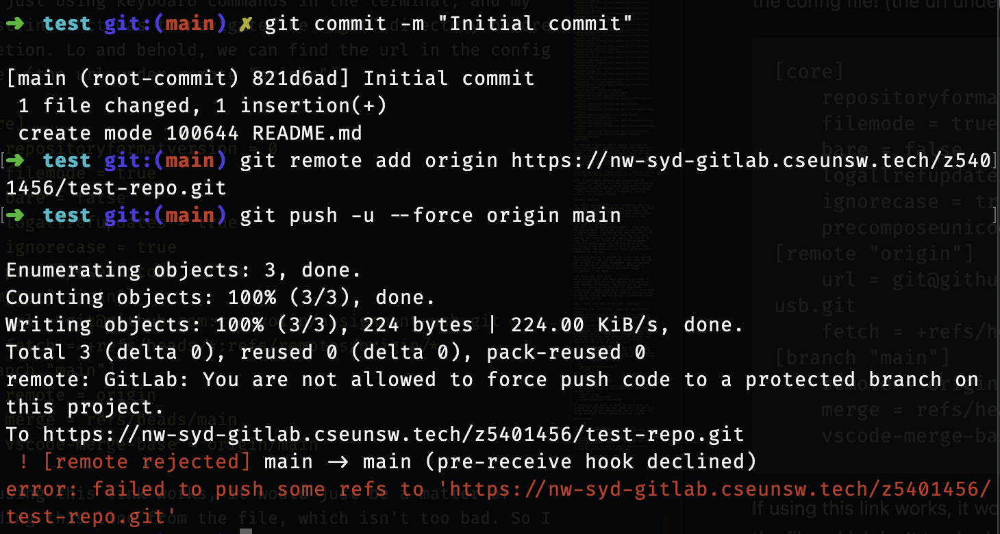

## Borrower.ino
Payload for mac that 'Borrows' your assignments. The payload itself uses `curl` to fetch and execute a bash program hosted by the attacker (since it would be too complicated to type things out line by line). This program searches for any directories for any directories or files matching any case of `COMPXXXX`, or anything with `ass/assignment` in their name. It then zips all relevant files into a zipfile, and then transfers this data over to the attacker's machine using `netcat`. 

### Development process
Initially I had dove into writing this one without experimenting with other payloads, and i'm honestly so glad I thought about trying to fetch and execute a payload first because i'm sure this way saved me alot of headache.

The first advantage of this, is that because I can instead run programs instead of just single line commands (you could have a massive one-liner but its a pain to write out), so this allows me to be able to write much more complicated logic. The second, more important point, is that this is much more secure for the attacker. While I just kept it as a hosted bash script, if the attacker were to host an executable instead, it would take much more work and experience with a disassembler for someone to be able to open and read the code for the program. This way, the logic and some details (such as the netcat address) could be obfuscated.

#### Recursion
The original `script.sh` was quite simple, and just recursively looked through each file in a directory, and then appended anything that had 'comp' or 'assignment' related naming into a tempfile. The issue with this was that you would get alot of duplicates. For example if you had the file structure:
```
files
    -> COMP6969
        -> assignment1
            -> cool.js
            -> more.js
        -> asst2.txt
```
... you would get multiple entries such as:
```
COMP6969
COMP6969/assignment1
COMP6969/assignment1/cool.js
COMP6969/assignment1/more.js
COMP6969/asst2.txt
```
so I simplified the recursion to terminate whenever we hit a directory or file that would match the regex condition (so in this example, it would just add the parent `COMP6969`). The advantages of this is that we would be able to save alot of space on the attacker's device by avoiding duplicates, and overall improve the speed of our payload, which would be advantageous to hiding the program from the target.

#### Kinda cursed regex
For a while, I did testing with a dummy directory (which can be seen in `client/clientfs`, and recreated with `dir_setup.sh`) to avoid casualties to my actual filesystem, so the first time I tried to run from root, it was stuck loading for a long while. Hence, I had a look at what files the program was trying to copy over... 

```
./Docker/docker-tutorial/node_modules/eslint/lib/rules/no-class-assign.js
./Docker/docker-tutorial/node_modules/eslint/lib/rules/no-cond-assign.js
./Docker/docker-tutorial/node_modules/eslint/lib/rules/no-const-assign.js
./Docker/docker-tutorial/node_modules/eslint/lib/rules/no-dupe-class-members.js
./Docker/docker-tutorial/node_modules/eslint/lib/rules/no-empty-character-class.js
./Docker/docker-tutorial/node_modules/eslint/lib/rules/no-ex-assign.js
./Docker/docker-tutorial/node_modules/eslint/lib/rules/no-func-assign.js
./Docker/docker-tutorial/node_modules/eslint/lib/rules/no-global-assign.js
./Docker/docker-tutorial/node_modules/eslint/lib/rules/no-import-assign.js
./Docker/docker-tutorial/node_modules/eslint/lib/rules/no-misleading-character-class.js
./Docker/docker-tutorial/node_modules/eslint/lib/rules/no-multi-assign.js
./Docker/docker-tutorial/node_modules/eslint/lib/rules/no-native-reassign.js
./Docker/docker-tutorial/node_modules/eslint/lib/rules/no-param-reassign.js
./Docker/docker-tutorial/node_modules/eslint/lib/rules/no-return-assign.js
./Docker/docker-tutorial/node_modules/eslint/lib/rules/no-self-assign.js
./Docker/docker-tutorial/node_modules/eslint/lib/rules/no-unused-private-class-members.js
./Docker/docker-tutorial/node_modules/eslint/lib/rules/operator-assignment.js
./Docker/docker-tutorial/src/assets
./Library/Application Scripts/com.apple.AppleMediaServicesUI.SpyglassPurchases
./Library/Application Scripts/com.apple.ClassKit-Settings.extension
./Library/Application Scripts/com.apple.ClassKit.diagnosticextension
./Library/Application Scripts/com.apple.Classroom-Settings.extension
./Library/Application Scripts/com.apple.PassKit.PaymentAuthorizationUIExtension
./Library/Application Scripts/com.apple.PassbookUIService.PeerPaymentMessagesExtension
./Library/Application Scripts/com.apple.Passwords-Settings.extension
./Library/Application Scripts/com.apple.languageassetd
./Library/Application Scripts/com.apple.messages.AssistantExtension
<AND MORE>
```
My regex was originally kind of simple; `([Cc][Oo][Mm][Pp])|([Aa][Ss]{2})`. Anything I needed would technically fulfilled the conditions, but alas we can never have good things!! Just from this chunk of output alone, you can notice things like `class`, `pass`, `compile`, `compilation`, `assign`, `assets` etc. being picked up. Which we probably don't want anyway. Hence, the regex was changed to this monstrosity:

```
([Cc][Oo][Mm][Pp][ _.-]?[0-9]{4})|^(.*[ _.-])?([Aa][Ss]{2})(([Ii][Gg][Nn][Mm][Ee][Nn][Tt])|[Tt])?(.*[ _.0-9-].*)?$
```
tldr; it would match anything case insensitively to
- compXXXX (technically could make it less restrictive but honestly just couldn't be bothered, also unlikely to that assignment related files would be called something else)
- fully matching 'ass, asst, or assignment' (with or without a file extension/numbers) 


You *could* technically have some assignments involving like `Class.java` or like `MyCompiler.rs`, which the regex would be at risk of missing, but its quite likely that they would belong in parent folders named something comp or assignment adjacent, and would be covered by just copying the entire parent folder.

#### Directory exclusion
Now that I was satisfied with my regex, I tried running the payload again, and we were still unfortunately met by a hanging program. From reading the tempfiles that I used to store candidate files, I found that they were empty, meaning that something else was causing the problem this time. Even if I did filter out alot of the extraneous files from being copied over, the program was still iterating through every single file on my system, many being things like source or asset files, which are pretty redundant to copy over.

My solution here was to exclude the script from checking the 'Library' / 'Applications' etc. folders that the user was unlikely to put their assignments (and also prevent the possibility of zipping up like. a 30 GB game or something by accident). Hence, an initial filter `is_excluded()` was added.

#### Module and cache files
While writing up the part about directory exclusion, I realised that while we prevent the user from searching some redundant directories, the script did not prevent them from zipping up and transferring large module or cache folders. Which would be an issue since it would take a long time for the files to be zipped up and transferred, increasing the risk that the payload is terminated before it completes its job. 
```
zip -r "$zip_file" -@ < "$temp_file" > /dev/null
```
Thankfully from [this](https://superuser.com/questions/178729/zipping-all-files-dirs-in-a-directory-except-hidden-ones) stack overflow page, I found that the `-x` flag could be used to exclude certain files.

#### Git history deletion attempt
From [this](https://gist.github.com/stephenhardy/5470814) code snippet, apparently you're able to delete your entire git history just by running a few terminal commands. Most of it would be pretty copy paste into the terminal, but one of the steps would require getting the original repository link to set as the new origin. 

I wanted to search for a way to be able to find the git url just using keyboard commands in the terminal, and my first instinct was to navigate the `.git` directory before deletion. Lo and behold, we can find the url in the config file! (the url under remote "origin")
```
[core]
	repositoryformatversion = 0
	filemode = true
	bare = false
	logallrefupdates = true
	ignorecase = true
	precomposeunicode = true
[remote "origin"]
	url = git@github.com:crocyoiin/assignment-usb.git
	fetch = +refs/heads/*:refs/remotes/origin/*
[branch "main"]
	remote = origin
	merge = refs/heads/main
	vscode-merge-base = origin/main
```
If using this link works, it would just be a matter of reading this line from the file, which isn't too bad. So I tried running the git commands with this url to make sure things would work before implementing in my program.

Unfortunately, we ran into a permissions issue since the main branch was protected (not sure if this is just a cse thing or a general gitlab thing with main origin protection) :( To fix this you would have to manually navigate to the gitlab page and modify the branch permissions there, which would be very difficult just with keyboard access so I ended up giving up on this feature. Due to the nature of the rubberducky acting as an input interface, trying to open a browser and navigate there would make things more visible to the target. Something else to note here is that the target might not have full git permissions for every repository in their system, hence there would not be a consistent way to disable branch protection for everything. In this case, to prioritise discreetness, it would be worth trading off this feature to keep things light and quick.



```
➜  uni git clone https://nw-syd-gitlab.cseunsw.tech/z5401456/test-repo.git test
Cloning into 'test'...
remote: Enumerating objects: 12, done.
remote: Counting objects: 100% (3/3), done.
remote: Compressing objects: 100% (2/2), done.
remote: Total 12 (delta 0), reused 0 (delta 0), pack-reused 9 (from 1)
Receiving objects: 100% (12/12), done.
Resolving deltas: 100% (1/1), done.
➜  uni cd test
➜  test git:(main) ls
README.md a
➜  test git:(main) rm -rf .git
➜  test ls
README.md a
➜  test rm a
➜  test echo "pee" > README.md
➜  test git init
Initialized empty Git repository in /Users/19chunnw3/uni/test/.git/
➜  test git:(main) ✗ git add .

➜  test git:(main) ✗ git commit -m "Initial commit"

[main (root-commit) b369927] Initial commit
 1 file changed, 1 insertion(+)
 create mode 100644 README.md
➜  test git:(main) git remote add origin https://nw-syd-gitlab.cseunsw.tech/z5401456/test-repo.git

➜  test git:(main) git push -u origin main

To https://nw-syd-gitlab.cseunsw.tech/z5401456/test-repo.git
 ! [rejected]        main -> main (fetch first)
error: failed to push some refs to 'https://nw-syd-gitlab.cseunsw.tech/z5401456/test-repo.git'
hint: Updates were rejected because the remote contains work that you do
hint: not have locally. This is usually caused by another repository pushing
hint: to the same ref. You may want to first integrate the remote changes
hint: (e.g., 'git pull ...') before pushing again.
hint: See the 'Note about fast-forwards' in 'git push --help' for details.
➜  test git:(main) 

```


### Usage
1) copy `script.sh` and `setup.sh` into the attacker machine
2) run `./setup.sh` to host the payload and also begin listening for any exfiltrated files (will also clean up the hosting process and extraneous files after the program is terminated)
3) load Exfiltrate.ino onto an arduino micro/leonardo
5) Plug the arduino into your target mac!