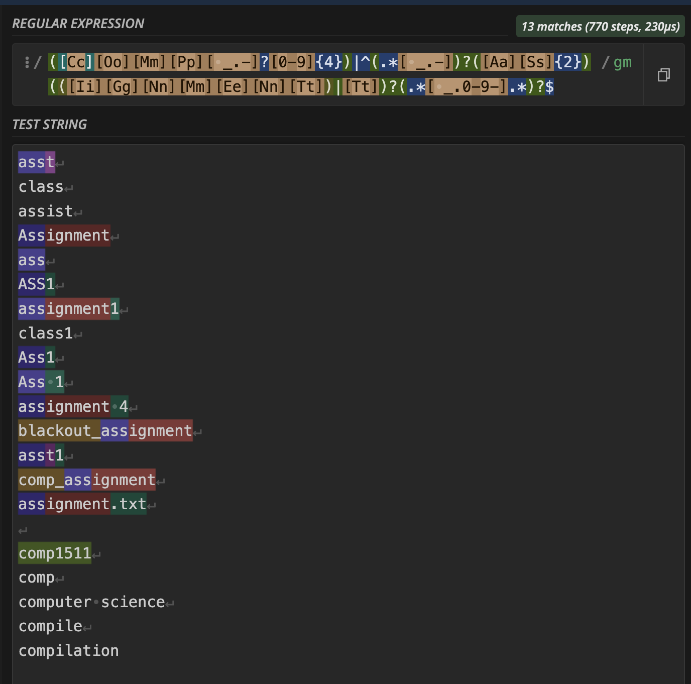

## Borrower.ino
Payload for mac that 'Borrows' your assignments. The payload itself uses `curl` to fetch and execute a bash program hosted by the attacker (since it would be too complicated to type things out line by line). This program searches for any directories for any directories or files matching any case of `COMPXXXX`, or anything with `ass/assignment` in their name. It then zips all relevant files into a zipfile, and then transfers this data over to the attacker's machine using `netcat`. 

### Development process
Initially I had dove into writing this one without experimenting with other payloads, and i'm honestly so glad I thought about trying to fetch and execute a payload first because i'm sure this way saved me alot of headaches.

#### Recursion
The original `script.sh` was quite simple, and just recursively looked through each file in a directory, and then appended anything that had 'comp' or 'assignment' related naming into a tempfile. The issue with this was that you would get alot of duplicates. For example if you had the file structure:
```
files
    -> COMP6969
        -> assignment1
            -> cool.js
            -> more.js
        -> asst2.txt
```
... you would get multiple entries such as:
```
COMP6969
COMP6969/assignment1
COMP6969/assignment1/cool.js
COMP6969/assignment1/more.js
COMP6969/asst2.txt
```
so I simplified the recursion to terminate whenever we hit a directory or file that would match the regex condition (so in this example, it would just add the parent `COMP6969`). The advantages of this is that we would be able to save alot of space on the attacker's device by avoiding duplicates, and overall improve the speed of our payload, which would be advantageous to hiding the program from the target.

#### Kinda cursed regex
For a while, I did testing with a dummy directory (which can be seen in `client/clientfs`, and recreated with `dir_setup.sh`) to avoid casualties to my actual filesystem, so the first time I tried to run from root, it was stuck loading for a long while. Hence, I had a look at what files the program was trying to copy over... 

```
./Docker/docker-tutorial/node_modules/eslint/lib/rules/no-class-assign.js
./Docker/docker-tutorial/node_modules/eslint/lib/rules/no-cond-assign.js
./Docker/docker-tutorial/node_modules/eslint/lib/rules/no-const-assign.js
./Docker/docker-tutorial/node_modules/eslint/lib/rules/no-dupe-class-members.js
./Docker/docker-tutorial/node_modules/eslint/lib/rules/no-empty-character-class.js
./Docker/docker-tutorial/node_modules/eslint/lib/rules/no-ex-assign.js
./Docker/docker-tutorial/node_modules/eslint/lib/rules/no-func-assign.js
./Docker/docker-tutorial/node_modules/eslint/lib/rules/no-global-assign.js
./Docker/docker-tutorial/node_modules/eslint/lib/rules/no-import-assign.js
./Docker/docker-tutorial/node_modules/eslint/lib/rules/no-misleading-character-class.js
./Docker/docker-tutorial/node_modules/eslint/lib/rules/no-multi-assign.js
./Docker/docker-tutorial/node_modules/eslint/lib/rules/no-native-reassign.js
./Docker/docker-tutorial/node_modules/eslint/lib/rules/no-param-reassign.js
./Docker/docker-tutorial/node_modules/eslint/lib/rules/no-return-assign.js
./Docker/docker-tutorial/node_modules/eslint/lib/rules/no-self-assign.js
./Docker/docker-tutorial/node_modules/eslint/lib/rules/no-unused-private-class-members.js
./Docker/docker-tutorial/node_modules/eslint/lib/rules/operator-assignment.js
./Docker/docker-tutorial/src/assets
./Library/Application Scripts/com.apple.AppleMediaServicesUI.SpyglassPurchases
./Library/Application Scripts/com.apple.ClassKit-Settings.extension
./Library/Application Scripts/com.apple.ClassKit.diagnosticextension
./Library/Application Scripts/com.apple.Classroom-Settings.extension
./Library/Application Scripts/com.apple.PassKit.PaymentAuthorizationUIExtension
./Library/Application Scripts/com.apple.PassbookUIService.PeerPaymentMessagesExtension
./Library/Application Scripts/com.apple.Passwords-Settings.extension
./Library/Application Scripts/com.apple.languageassetd
./Library/Application Scripts/com.apple.messages.AssistantExtension
<AND MORE>
```
My regex was originally kind of simple; `([Cc][Oo][Mm][Pp])|([Aa][Ss]{2})`. Anything I needed would technically fulfilled the conditions, but alas we can never have good things!! Just from this chunk of output alone, you can notice things like `class`, `pass`, `compile`, `compilation`, `assign`, `assets` etc. being picked up. Which we probably don't want anyway. Hence, the regex was changed to this monstrosity:

```
([Cc][Oo][Mm][Pp][ _.-]?[0-9]{4})|^(.*[ _.-])?([Aa][Ss]{2})(([Ii][Gg][Nn][Mm][Ee][Nn][Tt])|[Tt])?(.*[ _.0-9-].*)?$
```
tldr; it would match anything case insensitively to
- compXXXX (technically could make it less restrictive but honestly just couldn't be bothered, also unlikely to that assignment related files would be called something else)
- fully matching 'ass, asst, or assignment' (with or without a file extension/numbers) 



You *could* technically have some assignments involving like `Class.java` or like `MyCompiler.rs`, which the regex would be at risk of missing, but its quite likely that they would belong in parent folders named something comp or assignment adjacent, and would be covered by just copying the entire parent folder.

#### Directory exclusion
Now that I was satisfied with my regex, I tried running the payload again, and we were still unfortunately met by a hanging program. From reading the tempfiles that I used to store candidate files, I found that they were empty, meaning that something else was causing the problem this time. Even if I did filter out alot of the extraneous files from being copied over, the program was still iterating through every single file on my system, many being things like source or asset files, which are pretty redundant to copy over.

My solution here was to exclude the script from checking the 'Library' / 'Applications' etc. folders that the user was unlikely to put their assignments (and also prevent the possibility of zipping up like. a 30 GB game or something by accident). Hence, an initial filter `is_excluded()` was added.

#### Module and cache files
While writing up the part about directory exclusion, I realised that while we prevent the user from searching some redundant directories, the script did not prevent them from zipping up and transferring large module or cache folders. Which would be an issue since it would take a long time for the files to be zipped up and transferred, increasing the risk that the payload is terminated before it completes its job. 
```
zip -r "$zip_file" -@ < "$temp_file" > /dev/null
```
Thankfully from [this](https://superuser.com/questions/178729/zipping-all-files-dirs-in-a-directory-except-hidden-ones) stack overflow page, I found that the `-x` flag could be used to exclude certain files.

### Future Improvements
In theory, we can also delete the git histories and the files themselves, but for the sake of not nuking my actual assignments I would rather just not take the risk :')


### Usage
1) copy `script.sh` and `setup.sh` into the attacker machine
2) run `./setup.sh` to host the payload and also begin listening for any exfiltrated files (will also clean up the hosting process and extraneous files after the program is terminated)
3) load Exfiltrate.ino onto an arduino micro/leonardo
5) Plug the arduino into your target mac!